# Dépannage Windows : la machine de Mme Michu

Atelier de la formation Expert Cybersécurité que j'ai réalisé chez O'Clock. Une VM VirtualBox sous Windows 10 avec quatre pannes à trouver et à corriger : le démarrage, les performances, l'état des disques, des fichiers disparus.

---

## 1. Le démarrage

### Point de départ

La VM ne démarre pas. Écran noir avec ce message :

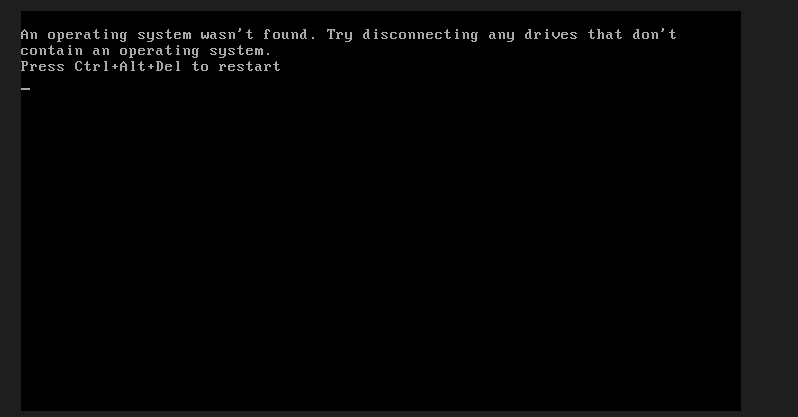

Premier truc que je remarque c'est que ce message ne vient pas de Windows. Il parle de disques, pas de fichiers et les messages de l'énoncé (`BOOTMGR is missing`, `Winload.exe introuvable`) sont produits par Microsoft via Windows.

### Est-ce que les disques sont là ?

F12 au lancement de la VM pour avoir le menu d'amorçage.

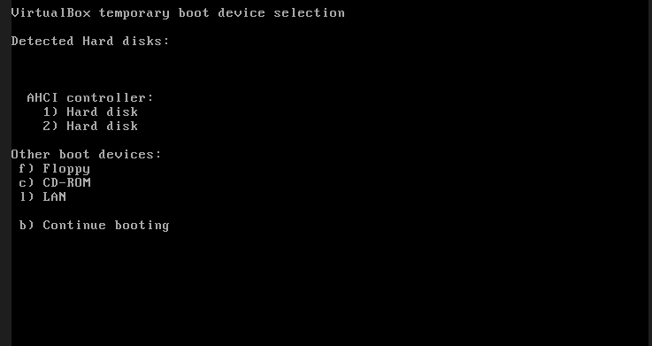

Deux disques sont détectés. Le problème est donc certainement sur le contenu des disques.

J'ai forcé l'amorçage sur chacun des deux : même erreur sur l'un et écran noir sur l'autre. Aucun n'est amorçable.

### Accéder à WinRE

J'ai mis un ISO Windows 10 dans le lecteur optique de la VM (pour simuler la clef USB que j'aurais normalement utilisée) et amorcé dessus. Puis **Réparer l'ordinateur** > **Dépannage** > **Invite de commandes**.

### Repérer les lecteurs

```
diskpart
list disk
list volume
```

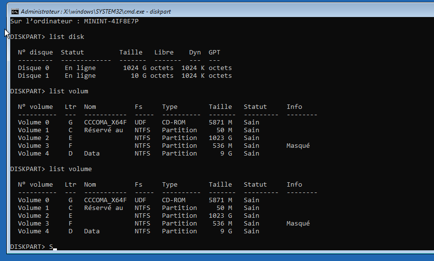

Ce que j'en tire :

| Disque | Partition | Taille | Lettre (WinPE) | Rôle |
|---|---|---|---|---|
| 0 | 1, active | 50 Mo | C: | Réservé au système |
| 0 | 2 | 1023 Go | E: | Windows |
| 0 | 3 | 536 Mo | F: | Récupération |
| 1 | 1 | 9 Go | D: | Données |

J'ai découvert en cherchant que la colonne "GPT" vide signifie que le disque est en "MBR", donc démarrage BIOS. 

### Ce qui manquait

```
dir C:\ /a
```

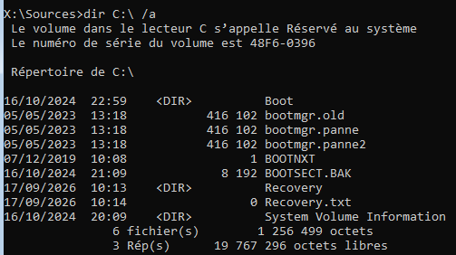

Trois fichiers `bootmgr.old`, `bootmgr.panne`, `bootmgr.panne2`, et plus aucun fichier nommé simplement `bootmgr`. C'est ça, le `BOOTMGR is missing`.
J'ai découvert au passage, en cherchant les commandes, que dir masque par défaut les fichiers cachés, il faut "/a" pour tout voir.

Même chose pour l'autre partition :

```
dir E:\Windows\System32\winload* /a
dir E:\Users
```

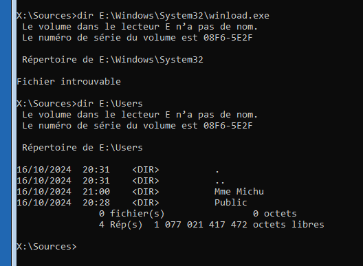

`winload.exe` absent, `winload.panne` présent. Et `E:\Users` contient le profil **"Mme Michu"**, ce qui confirme que c'est bien ce volume qu'il faut réparer.

### Correction

Rien n'avait été supprimé, seulement renommé. Les deux noms d'origine étaient donnés en clair par les messages d'erreur de l'énoncé.

```
ren C:\bootmgr.panne bootmgr
ren E:\Windows\System32\winload.panne winload.exe
```

ISO retiré et redémarrage :


---

## 2. Les performances

### Le constat

Processeur à 100 %, mémoire à 90 %, et plus de 420 processus en arrière-plan et le compteur montait en boucle.

Presque tous les processus sont des `PING.EXE`.

J'ai ajouté la colonne **Ligne de commande** (clic droit sur l'en-têtes du gestionnaire des tâches). C'est ce qui débloque le diagnostic :

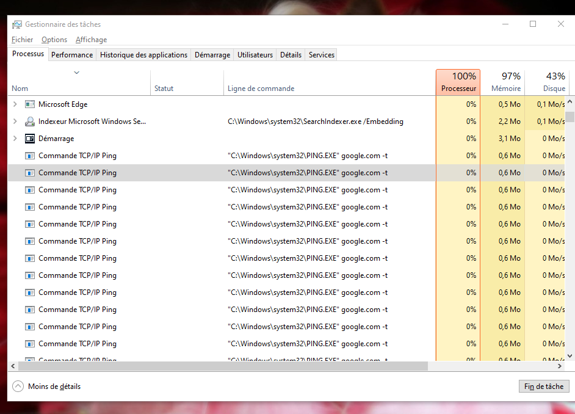

`ping google.com -t`. En cherchant, j'ai appris que `-t` veut dire "continu", sans lui chaque ping s'arrêterait seul. Là ils tournent à l'infini et s'accumulent sur la machine.

### Trouver ce qui les lance

Tuer les processus ne sert à rien tant que ce qui les crée tourne encore. Onglet **Démarrage** :

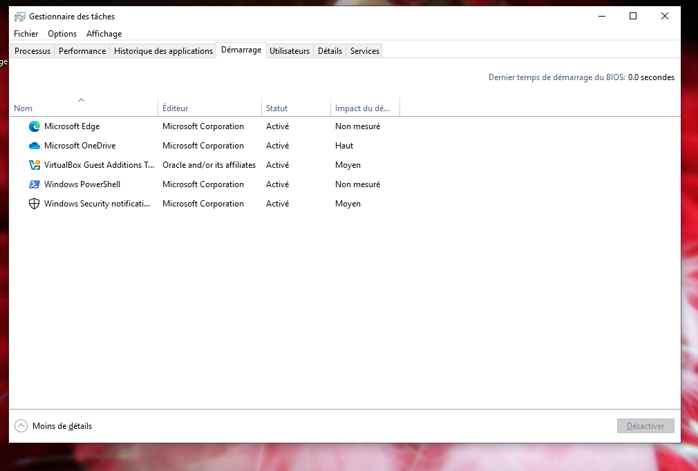

**Windows PowerShell** n'est pas normal ici. Windows ne lance pas PowerShell au démarrage normalement.

L'entrée vient du dossier de démarrage de l'utilisateur. On y accède en tapant `shell:startup` dans la barre d'adresse de l'explorateur. Il contient un raccourci nommé `Ping`, et voici sa cible :

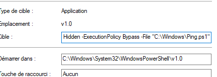

Trois choses à lire dedans :

- `-WindowStyle Hidden` : aucune fenêtre n'apparaît
- `-ExecutionPolicy Bypass` : contourne la politique d'exécution
- `-File "C:\Windows\Ping.ps1"` : le script est "caché" dans `C:\Windows`

Le script :

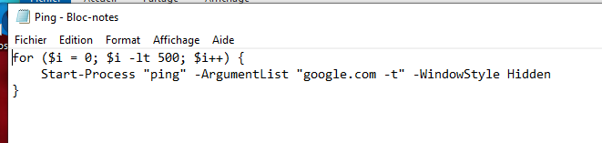

```powershell
for ($i = 0; $i -lt 500; $i++) {
    Start-Process "ping" -ArgumentList "google.com -t" -WindowStyle Hidden
}
```

500 ping continus, relancés à chaque ouverture de session.

### Correction

Dans cet ordre :

1. supprimer le raccourci `Ping` dans le dossier de démarrage
2. supprimer `C:\Windows\Ping.ps1`
3. Redémarrer la machine

Après redémarrage :

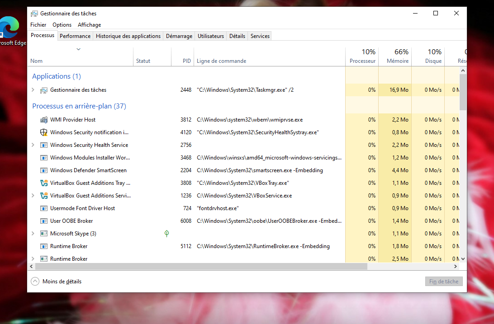

| | Avant | Après |
|---|---|---|
| Processus en arrière-plan | 426 puis 539, en hausse | 37 |
| Processeur | 100 % | 10 % |
| Mémoire | 90 à 97 % | 66 % |

---

## 3. Les disques

Mme Michu craignait que ses disques soient défectueux. Gestion des disques (clic droit sur le logo Windows dans la barre des tâches) :

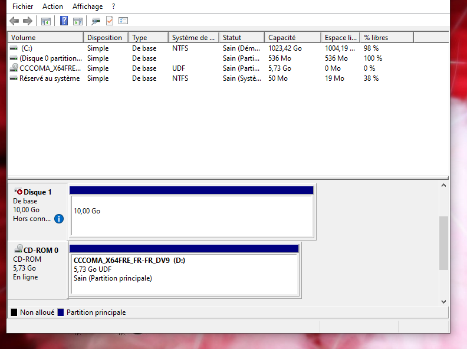

Le disque 1 est **hors connexion** avec comme motif "stratégie définie par un administrateur". Le disque n'est pas cassé, c'est défini volontairement.

```
diskpart
select disk 1
attributes disk
```

La sortie montre deux choses distinctes : le disque est hors connexion **et** en lecture seule. Si je le remets en ligne sans retirer le second attribut, il remonte inutilisable.

```
attributes disk clear readonly
online disk
```

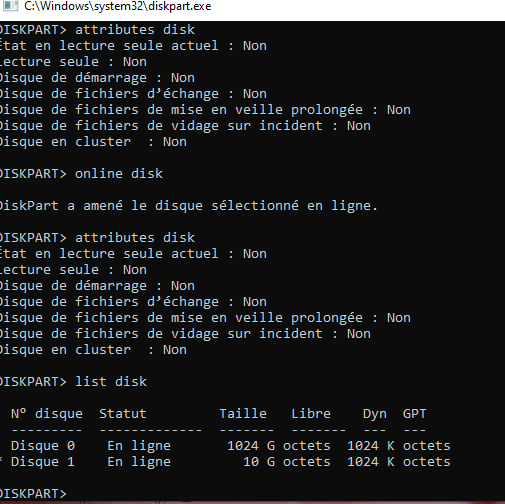

Ensuite `chkdsk` pour répondre vraiment à la question posée :

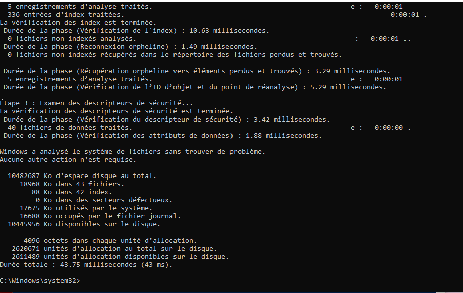

```
Windows a analysé le système de fichiers sans trouver de problème.
       0 Ko dans des secteurs défectueux.
```

Rien à signaler. Et sur le disque système un scan en lecture seule n'a rien trouvé non plus.

**Conclusion : aucun défaut matériel.** Le disque était juste rendu invisible par des attributs logiciels définis par quelqu'un volontairement.

---

## 4. Les fichiers disparus

Un fichier `SOS !` laissé dans le dossier "Images" explique qu'un dossier contenant les photos de Yorkshires a été supprimé.

Après la remise en ligne du disque 1, un dossier `York` réapparaît. Sauf que le chemin complet est :

```
E:\FileHistory\Mme Michu\DESKTOP-8DF7QI8\Data\C\Users\Mme Michu\Pictures\York
```

`FileHistory` est l'**Historique des fichiers** de Windows. Le disque 1 n'est pas un disque de données mais un disque de sauvegarde. Ce que je regardais était une copie versionnée pas le dossier d'origine.

Copier les fichiers à la main marcherait mais je récupérerais les noms horodatés. La bonne méthode passe par l'interface de l'historique, qui restaure à l'emplacement d'origine avec les vrais noms : **Panneau de configuration** > **Historique des fichiers** > **Restaurer des fichiers personnels**.

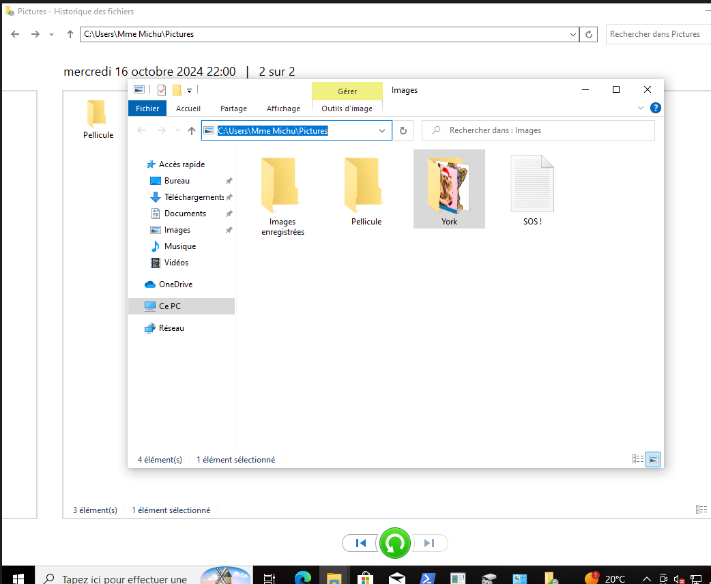

La sauvegarde contient aussi `Ping.ps1`. Si on restaure tout en bloc, la panne de l'étape 2 revient je prends donc la décision de supprimer le script ici aussi afin de préserver Mme Michu et ses Yorkshires.

---

## Récapitulatif

| Étape | Cause réelle | Correction |
|---|---|---|
| Démarrage | `bootmgr` et `winload.exe` renommés | Remise des noms d'origine |
| Performances | Script PowerShell au démarrage lançant 500 ping continus | Suppression du raccourci et du script |
| Disques | Disque 1 hors connexion et en lecture seule | Attributs retirés via `diskpart` |
| Fichiers | Dossier `York` supprimé | Restauration par l'Historique des fichiers |

## Ce que j'ai appris

La nécessité de `bootmgr` et de `winload.exe`, au démarrage et beaucoup de commandes découvertes en cours de route.
